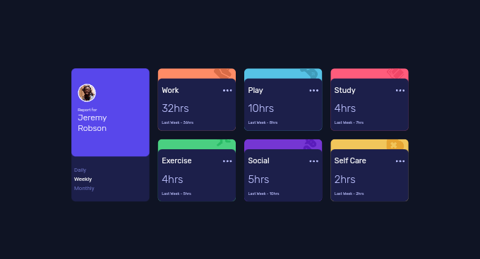

# Frontend Mentor - Time tracking dashboard solution

This is a solution to the [Time tracking dashboard challenge on Frontend Mentor](https://www.frontendmentor.io/challenges/time-tracking-dashboard-UIQ7167Jw). Frontend Mentor challenges help you improve your coding skills by building realistic projects. 

## Table of contents

- [Overview](#overview)
  - [The challenge](#the-challenge)
  - [Screenshot](#screenshot)
  - [Links](#links)
- [My process](#my-process)
  - [Built with](#built-with)
  - [What I learned](#what-i-learned)
  - [Continued development](#continued-development)
  - [Useful resources](#useful-resources)
- [Author](#author)
- [Acknowledgments](#acknowledgments)


## Overview

### The challenge

Users should be able to:

- View the optimal layout for the site depending on their device's screen size
- See hover states for all interactive elements on the page
- Switch between viewing Daily, Weekly, and Monthly stats

### Screenshot



### Links

- Solution URL: [GitHub Repository](https://codeevolver.github.io/time-tracking-dashboard-main)
- Live Site URL: [GitHub Page](https://codeevolver.github.io/time-tracking-dashboard-main/)

## My process

### Built with

- Semantic HTML5 markup
- CSS custom properties
- Flexbox
- CSS Grid
- Mobile-first workflow
- JavaScript 
- SCSS
- [Styled Components](https://styled-components.com/) - For styles


### What I learned

I learnt how to easily get data from object and display it in my html. I also learnt how to change content based on selected options from menu buttons.

```html
<section>I made use of section</section>
```
```css
.proud-of-this-css {
  grid-template-columns: repeat(auto-fit, minimax(13rem, 1fr);
}
```
```js
buttons.forEach(button => {
    button.addEventListener('click', () => {
        activateClickedButton(button);
        const clickedOption = button.dataset.option;
        renderCards(clickedOption);
    })
})
```

### Continued development

I'd like to focus on DOM manipulations in future projects. I would also like to refine and know more of JavaScript, so that I will be able to use it better in future projects..

### Useful resources

- [Seer Studio JavaScript](https://youtu.be/l9Qw8y3LfCY) - This helped me to know more of DOM and JavaScript. I really liked this pattern and will use it going forward.
- [Flex Box](https://www.w3schools.com/css/css3_flexbox.asp) - This is an amazing article which helped me to gain more understanding of flex-box. I'd recommend it to anyone still learning this concept.

## Author

- Website - [Goodness Okanlawon](https://github.com/CodeEvolver)
- Frontend Mentor - [@CodeEvolver](https://www.frontendmentor.io/profile/CodeEvolver)
- Twitter - [@Code_Evolver](https://www.twitter.com/Code_Evolver)

## Acknowledgments

Glory to God, the source of all wisdom. Kudos to Seer Studio (Grizhlie Codes), the video was explanatory.
